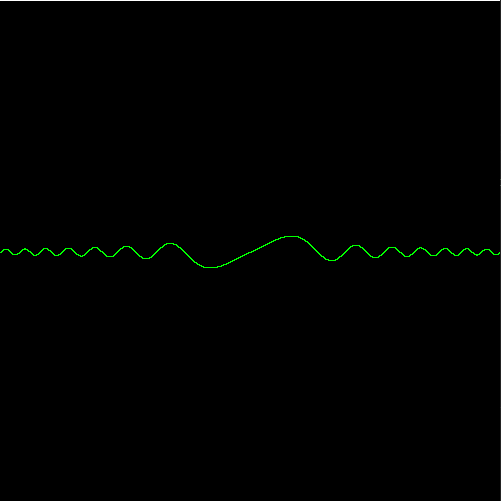
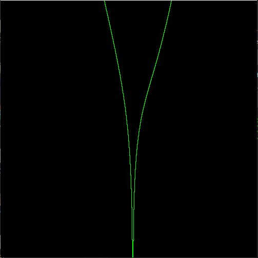

# Graphing-Calculator-1
A simple graphing calculator written in python. Supports the following functions:  
* sin
* cos
* tan
* sqrt
* ln
* log
* exponents
* and basic math operands
## Usage:
Run [main.py](main.py) and enter an equation. All operands must be explicitly stated, meaning if youu want to graph 5x, you must type 5\*x. y= is not supported and the only availible variable is x. 
Use the mouse wheel to zoom in and out and click and drag to move the viewport.
## Examples:
#### Graph Example 1:
}{x}})
 

#### Graph Example 2:
&plus;ln(x^)}) 

